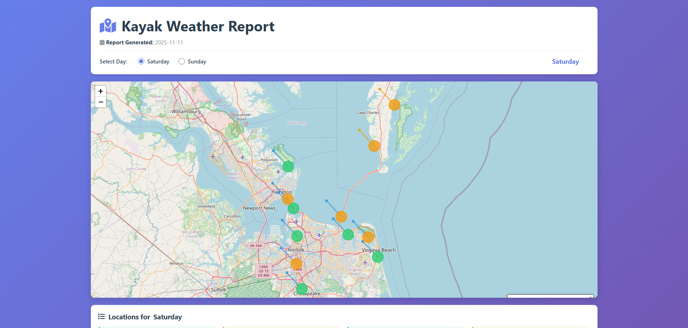

# Kayak Weather Report Web Application

A interactive web application that displays kayak fishing location forecasts on an interactive map with weather and tide information.

## Preview



## Features

✨ **Interactive Map Display**
- View all kayak fishing locations on an interactive map
- Locations are color-coded by forecast rating (green/good, yellow/okay, red/bad)
- Pan, zoom, and explore the map freely

🎯 **Color-Coded Ratings**
- **Green (Good)** - Excellent conditions for kayak fishing
- **Yellow (Okay)** - Fair conditions, some challenges
- **Red (Bad)** - Poor conditions, not recommended

📅 **Day Toggle**
- Switch between Saturday and Sunday forecasts
- Each day has different weather and tide conditions
- Real-time UI updates when switching days

🗺️ **Location Details**
- Click or hover over map markers to see detailed information
- View location name and forecast rating
- See comprehensive hover facts including:
  - High and low tide times
  - Wind speed and direction
  - Water temperature
  - Current speed
  - Additional notes and insights

📋 **Location Listing**
- Below the map, find a complete list of all locations for the selected day
- Each card shows:
  - Location name and rating
  - Summary of conditions
  - Tide information
  - Wind and water temperature

📊 **Report Generation Date**
- Display of when the report was generated
- Header shows current day selection

## Installation

1. **Clone the repository**
   ```bash
   cd kayak_weather_report
   ```

2. **Create a virtual environment** (if not already created)
   ```bash
   python -m venv .venv
   .venv\Scripts\activate  # On Windows
   ```

3. **Install dependencies**
   ```bash
   pip install -r requirements.txt
   ```

## Running the Application

1. **Start the Flask server**
   ```bash
   python app.py
   ```

2. **Open in web browser**
   - Navigate to `http://localhost:5000`
   - The app will load with Saturday's forecast by default

3. **Using the app**
   - Toggle between Saturday and Sunday using the day selector
   - Hover over or click map markers to see location details
   - Scroll down to see the location listing below the map
   - Use map controls to zoom and pan

## File Structure

```
kayak_weather_report/
├── app.py                      # Flask application and routing
├── kayak_forecast.json         # Weather forecast data
├── requirements.txt            # Python dependencies
├── templates/
│   └── index.html             # Main HTML template with CSS and JavaScript
└── README.md                  # This file
```

## Data Format

The `kayak_forecast.json` file contains:
- Report generation date
- Array of locations with:
  - Name and coordinates
  - Day (Saturday/Sunday)
  - Rating (good/okay/bad)
  - Summary description
  - Comprehensive hover facts
  - Color rating

## Technology Stack

- **Backend**: Flask (Python web framework)
- **Mapping**: Folium + Leaflet (Interactive maps)
- **Frontend**: HTML5, CSS3, Vanilla JavaScript
- **Styling**: Custom CSS with responsive design


Enjoy exploring kayak fishing forecasts! 🛶⛅
